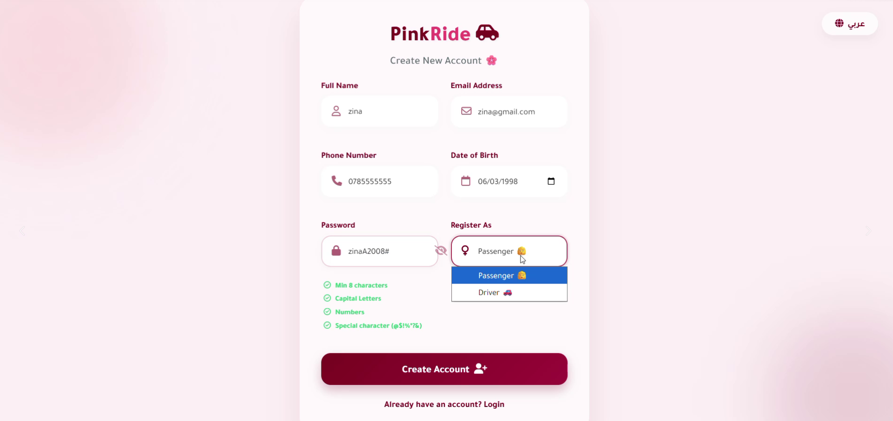
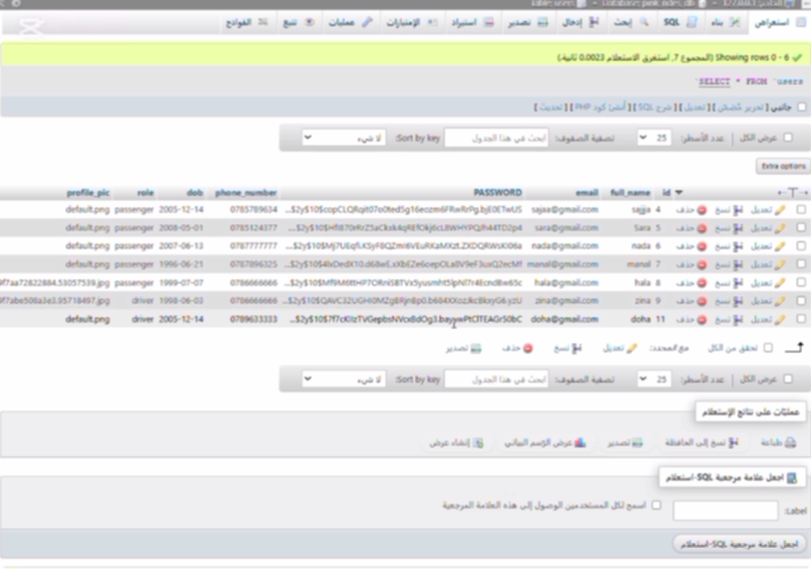
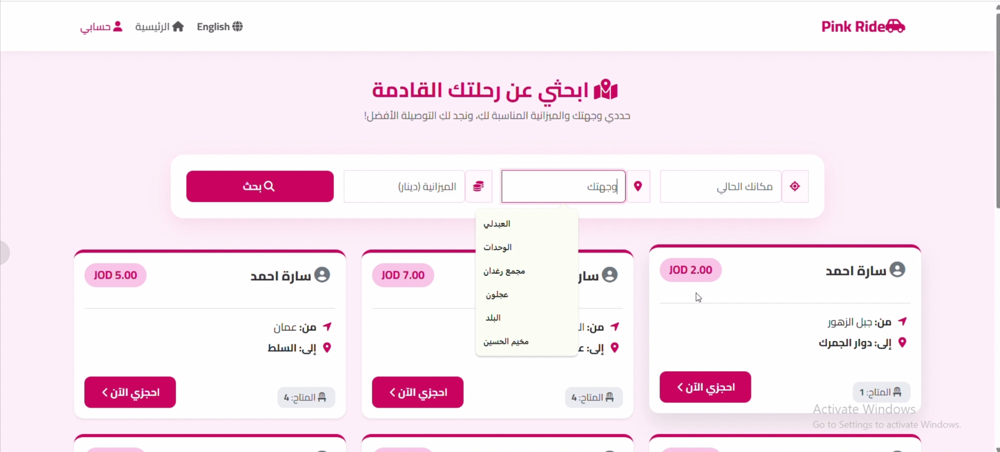

# 🚗 Pink Ride - Premium Women's Carpooling Platform

<p align="center">
</p>

<p align="center">
  <strong>A secure, production-ready, full-stack web ecosystem built for exclusive female ride-sharing and optimized capacity distribution.</strong>
</p>

<p align="center">
  
  
  
  
</p>

---

## 📌 Project Architecture & Vision

**Pink Ride** is a high-quality web platform engineered with **PHP** and **MySQL** to address daily transit and commuting security challenges for women and university students. By using an advanced multi-role paradigm, the platform facilitates safe, economical, and decentralized ride-pooling. 

### 💡 Core Operations Flow
* **The Drivers:** Create customized routes, define pricing schedules, and dynamically scale ride availability up to a maximum **4-seat threshold** per vehicle.
* **The Passengers:** Intuitively browse paths via responsive multi-tier queries, leverage real-time cost-efficiency filters, and instantly lock seats.

---

## 🔥 Key Technical Superpowers

### 1. 👥 Multi-Role Authorization & Dashboard Matrix
Separate user execution spaces dynamically generated via PHP variables.
* **Driver View (`driver_dashboard.php`):** Full autonomous control over current trip distribution. Integrated with instant database updates (`INSERT`, `SELECT`, `UPDATE`).
* **Interactive Modals:** Backed by **SweetAlert2** injection for clean, seamless asynchronous user validation prompts (e.g., delete confirmation hooks).

### 2. 🔐 Industrial-Grade Security Best Practices
* **SQL Injection Blockers:** Strict usage of Native Prepared Statements (`$conn->prepare()`) combined with parameter binding (`bind_param()`) for all crucial operational actions like `delete_ride.php` and `edit_ride.php`.
* **Cross-Account Session Protection:** Hard-token checking prevents malicious parameter manipulation. Drivers can *only* alter or delete rows that uniquely mismatch their active encrypted `$_SESSION['user_id']`.
* **Password Hashing:** Implements full cryptographic salting verification via `password_verify()` during login stages.
* **XSS Mitigation & UI Validation:** All textual readouts utilize `htmlspecialchars()` escaping. Client-side state engines freeze inputs instantly if regular expressions (Regex) spot invalid structured input formatting (e.g., modern immediate mail triggers).

### 3. 🌐 Native Hybrid Dual-Language Localizer
* A completely built-in localization mechanism (`lang.php`) capable of hot-swapping global translation matrices dynamically on-the-fly.
* Features automatic memory persistence across standard user lifecycles using structured combinations of persistent browser `setcookie()` tracking and short-lived `$_SESSION` storage arrays.
---

## 📸 Production Environment Snapshots

| User Registration & Validation | Database Encrypted Hashing | Dynamic Ride Search & Filters |
| :---: | :---: | :---: |
|  |  |  |

---
<p align="center">Engineered with high technical compliance for modern web performance. 🚀</p>


---


## 📁 Repository Blueprint

```text
pink_ride/
├── lang.php               # System-wide localization router & full text dictionary
├── db_connect.php         # Database configuration, connection setups, and UTF-8 charset enforcers
├── index.php              # Modern localized landing interface & gateway portal
├── about.php              # Academic project context, institutional info, and developers roster
├── login.php              # Secure login module with instant RegEx input checking
├── logout.php             # Full memory cleanup & cryptographic browser cookie destruction 
├── driver_dashboard.php   # Central operational center for drivers with SweetAlert2 integration
├── edit_ride.php          # Protected trip adjustment interface
├── delete_ride.php        # Strict parameterized validation and database drop execution
├── book.php               # Inventory subtraction routine checking seat-capacity states
└── pink_rides_db.sql      # Database schema migrations and data structures scriptns script
